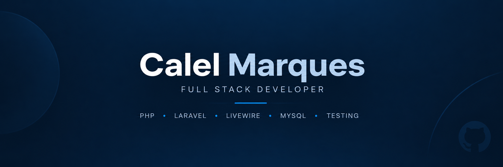

  

## About

I build full-stack web applications with a focus on the Laravel ecosystem, maintainable code, automated testing, and well-structured software.

## Tech Stack

  
  
  
  
  
  
  
  
  
  

## Featured Project

### [Mesa](https://github.com/caalel/mesa)

Mesa is a nutrition-focused web application for comparing foods across calories, protein, carbohydrates, and fat, as well as building meals while tracking their nutritional totals.

Built with Laravel, Livewire, and MySQL, it includes automated testing and TDD, a reproducible nutritional-data import pipeline, and documented architecture and technical decisions.

[View repository](https://github.com/caalel/mesa)

## Contact

  
  

