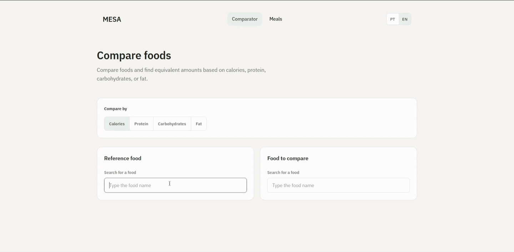

  

## About

Full Stack Developer focused on PHP and Laravel. I build Laravel and Livewire applications with MySQL, dedicated service classes, transactional data flows, TDD, and GitHub Actions CI.

My main project, Mesa, includes 300+ automated tests, atomic guest-to-user meal migration, and a reproducible TACO 4 nutritional-data pipeline.

## Tech Stack

  
  
  
  
  
  
  
  

## Featured Project

### [Mesa](https://github.com/caalel/mesa)

A nutrition web application for comparing foods and building meals while tracking calories and macronutrients.

  

Laravel 13 · Livewire 4 · MySQL · TDD · GitHub Actions CI

300+ automated tests · transactional guest-to-user migration · reproducible TACO 4 data pipeline · bilingual interface

[View repository →](https://github.com/caalel/mesa)

## Contact

  
  

